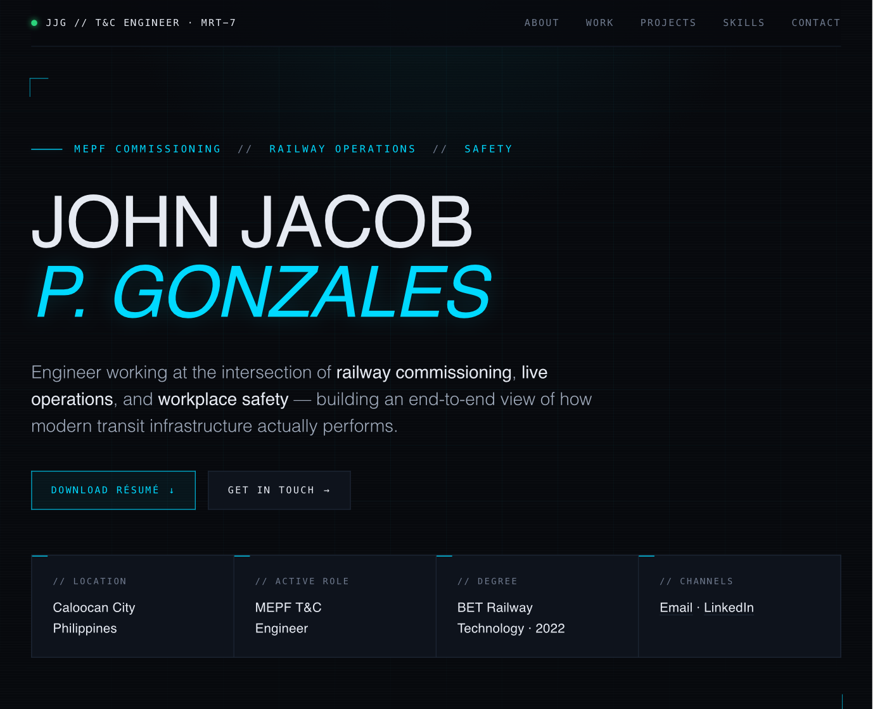
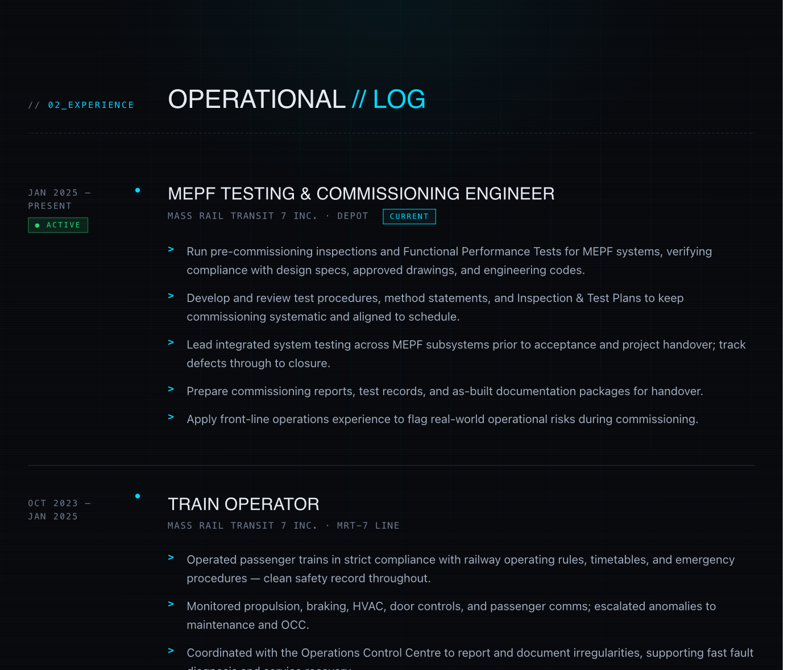
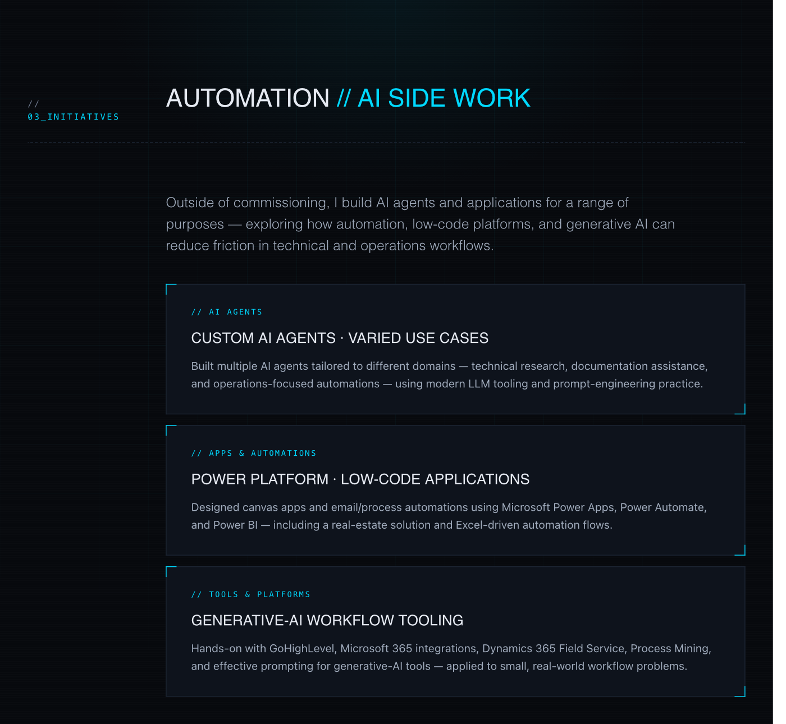
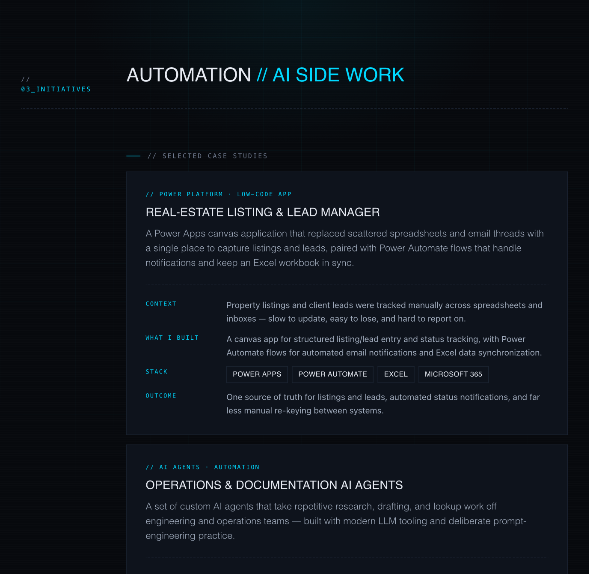
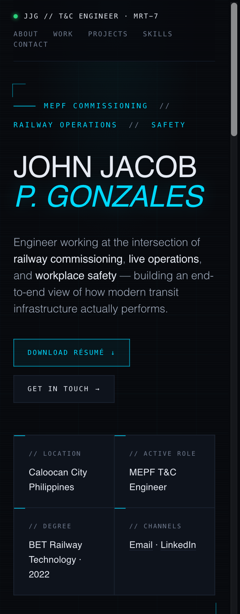

<div align="center">

# John Jacob P. Gonzales — Portfolio

**Testing &amp; Commissioning Engineer · Train Operator · Associate Safety Officer — MRT-7**

A fast, accessible, dependency-free personal portfolio with a "transit / HUD" visual identity.

[](#tech-stack)
[](#tech-stack)
[](#tech-stack)
[](#deployment)
[](LICENSE)

[**Live site**](https://johnjacobgonzales.pages.dev/) · [Features](#features) · [Run locally](#run-locally) · [Deploy](#deployment) · [Architecture](#architecture)

</div>

---

## Overview

A single-page portfolio that presents an unusual, deliberate career blend — **railway commissioning + live operations + workplace safety**, now extending into **process automation and AI tooling**. The site is engineered to be:

- **Zero-dependency** — no framework, no build step, no npm install. One HTML file plus static assets.
- **Robust** — content is fully visible even with JavaScript disabled (progressive enhancement).
- **Accessible** — WCAG-conscious contrast, keyboard focus styles, skip link, reduced-motion support.
- **SEO/social ready** — Open Graph, Twitter cards, JSON-LD `Person` schema, sitemap, robots.
- **Printable** — a built-in print stylesheet turns the page into a clean résumé ("Download résumé" → Save as PDF).

## Features

| Area | What it does |
|------|--------------|
| 🎨 Design system | CSS custom properties for color, type scale, and shared layout grid |
| ⚡ Performance | No JS framework; ~single request beyond fonts; long-cache headers for assets |
| ♿ Accessibility | Skip link, visible `:focus-visible` rings, AA-compliant contrast, `prefers-reduced-motion` |
| 🧱 Resilience | Scroll-reveal is progressively enhanced — no-JS users still see all content |
| 🧭 Navigation | Sticky nav, scroll-spy active-section highlight, back-to-top button |
| 🖨️ Résumé export | `@media print` stylesheet + "Download résumé" button (Save as PDF) |
| 🔎 SEO | Meta description, canonical, OG/Twitter tags, JSON-LD, `sitemap.xml`, `robots.txt` |
| 🛡️ Security headers | CSP, `X-Content-Type-Options`, `X-Frame-Options`, `Referrer-Policy`, `Permissions-Policy` via `_headers` |
| 🚧 Friendly 404 | On-brand `404.html` error page |

## Screenshots

### Hero


### Experience timeline


### Projects & case studies



### Mobile


> Screenshots are rendered from the live page. To regenerate after content changes,
> see the capture notes in [`docs/DEPLOYMENT.md`](docs/DEPLOYMENT.md).

## Tech stack

- **HTML5** — semantic structure (`header`, `nav`, `main`, `section`, `footer`)
- **CSS3** — custom properties, CSS Grid, Flexbox, `clamp()` fluid type, `@media print`, `prefers-reduced-motion`
- **Vanilla JavaScript** — `IntersectionObserver` for scroll-reveal + scroll-spy, back-to-top, print trigger
- **Google Fonts** — Chakra Petch, IBM Plex Sans, JetBrains Mono
- **Hosting** — Cloudflare Pages (static)

## Run locally

No build tools required. Any static server works:

```bash
# Option A — Python (preinstalled on macOS/Linux)
python3 -m http.server 8080

# Option B — Node
npx serve .

# then open
open http://localhost:8080
```

You can also just double-click `index.html`, but a local server is recommended so absolute asset paths and the manifest resolve correctly.

## Configuration

Edit content directly in [`index.html`](index.html). Common changes:

| To change… | Edit… |
|------------|-------|
| Colors / theme | the `:root { --… }` CSS variables near the top of the `<style>` block |
| Name, tagline, bio | the `<header class="hero">` and `#about` section |
| Experience | the `.exp` blocks in `#experience` |
| Skills | the `.skill-row` blocks in `#skills` |
| Certifications | the `.cert` blocks in `#certs` |
| Contact details | `#contact` links + the JSON-LD block in `<head>` |
| Canonical / OG URL | update every `https://johnjacobgonzales.pages.dev/` to your final domain |

> **After choosing a final domain**, search-and-replace the placeholder URL in `index.html`, `sitemap.xml`, and `robots.txt`.

## Usage

- **Download résumé**: the hero button downloads a ready-made, brand-matched PDF résumé ([`assets/John_Jacob_P_Gonzales_Resume.pdf`](assets/John_Jacob_P_Gonzales_Resume.pdf)). A `@media print` stylesheet is also included, so visitors who press Ctrl/Cmd+P get a clean light version of the page too.
- **Navigation**: sticky top nav with active-section highlighting; back-to-top appears after scrolling.

## Deployment

Recommended: **Cloudflare Pages** (free, global CDN, ideal for a static single-page site).

See [`docs/DEPLOYMENT.md`](docs/DEPLOYMENT.md) for full step-by-step instructions (dashboard method **and** GitHub Actions CI/CD), plus the OG-image PNG note.

Quick version:

1. Push this repo to GitHub.
2. Cloudflare Dashboard → **Workers & Pages** → **Create** → **Pages** → **Connect to Git**.
3. Framework preset: **None**. Build command: *(empty)*. Output directory: `/` (repo root).
4. Deploy. Cloudflare serves `index.html`, `_headers`, `_redirects`, and `404.html` automatically.

## Architecture

```
john-jacob-gonzales-portfolio/
├── index.html              # The entire site (HTML + CSS + JS, intentionally single-file)
├── 404.html                # On-brand error page
├── robots.txt              # Crawler directives
├── sitemap.xml             # Single-URL sitemap
├── site.webmanifest        # PWA / icon manifest
├── _headers                # Cloudflare Pages security + cache headers
├── _redirects              # Cloudflare Pages redirects (legacy filename → /)
├── assets/
│   ├── favicon.svg                     # Scalable favicon
│   ├── og-image.svg                    # Social card (source)
│   ├── og-image.png                    # Social card (1200×630, used by meta tags)
│   └── John_Jacob_P_Gonzales_Resume.pdf# Downloadable résumé (hero button)
├── docs/
│   ├── DEPLOYMENT.md       # Deployment guide
│   └── PORTFOLIO.md        # Portfolio blurbs, résumé entries, LinkedIn copy
├── .github/                # Issue/PR templates + deploy workflow
├── LICENSE                 # MIT
├── CONTRIBUTING.md
├── CODE_OF_CONDUCT.md
├── SECURITY.md
└── CHANGELOG.md
```

**Why single-file?** For a static résumé page, a single self-contained `index.html` is the most honest engineering choice: nothing to build, nothing to break, instant load, trivially auditable. CSS variables and a shared `.colgrid` utility keep it maintainable despite living in one file.

## Future improvements

- Self-host & subset fonts to drop the third-party request and improve LCP.
- Add real screenshots and a short case-study writeup of one automation project.
- Optional: privacy-friendly analytics (e.g. Cloudflare Web Analytics — no cookies).
- Optional: contact form (Cloudflare Pages Functions / Web3Forms) to avoid exposing the phone number.

## License

[MIT](LICENSE) © 2026 John Jacob P. Gonzales. Content (bio, experience, certifications) is personal and not licensed for reuse.
